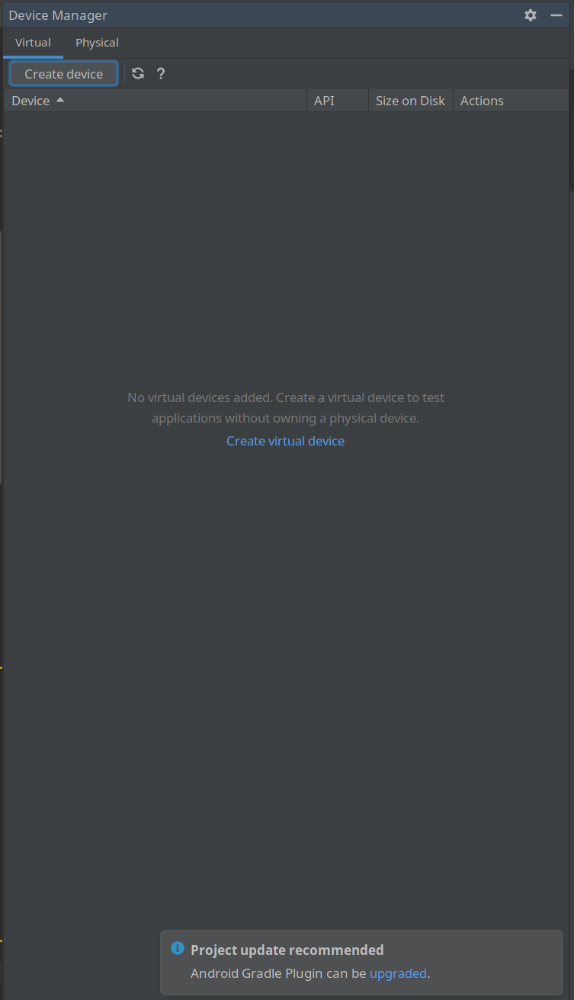
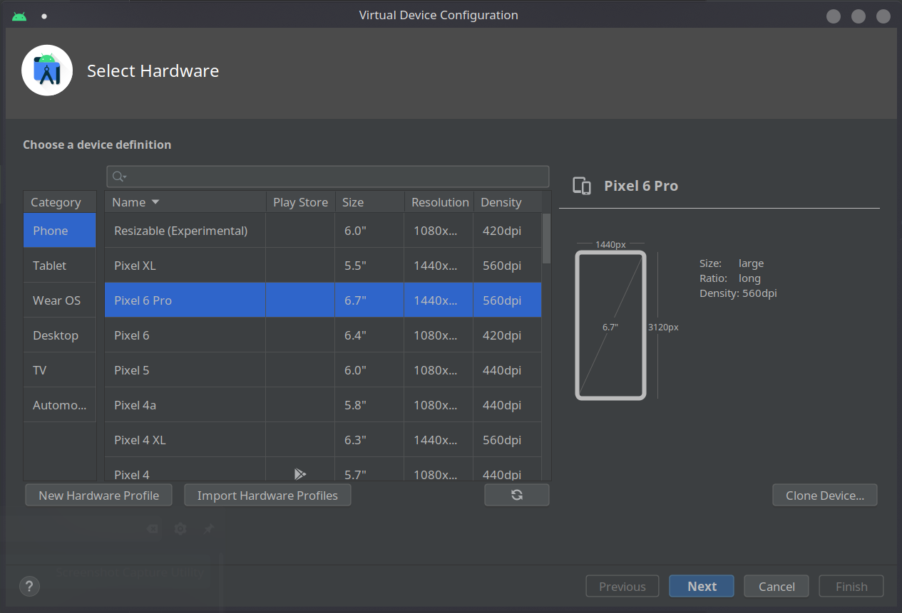
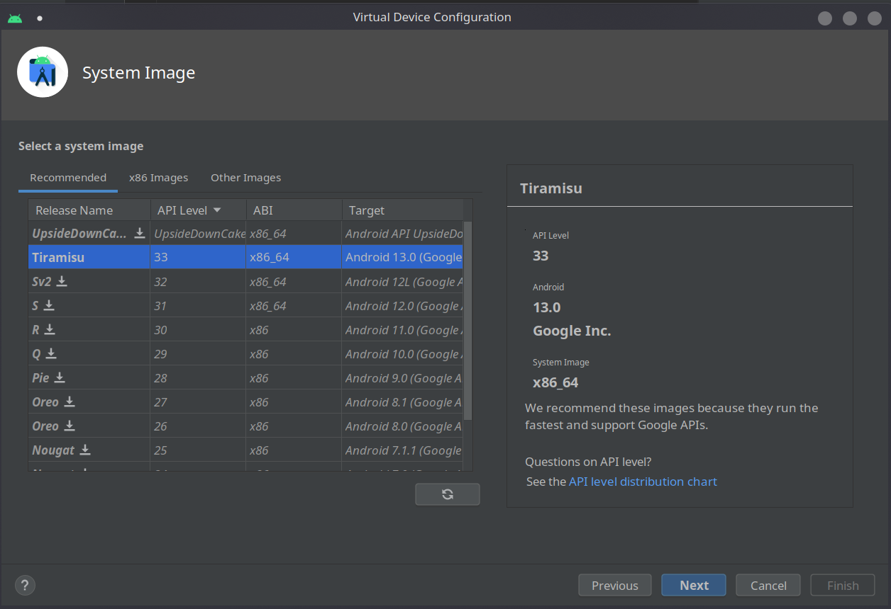
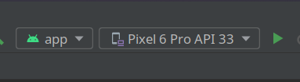
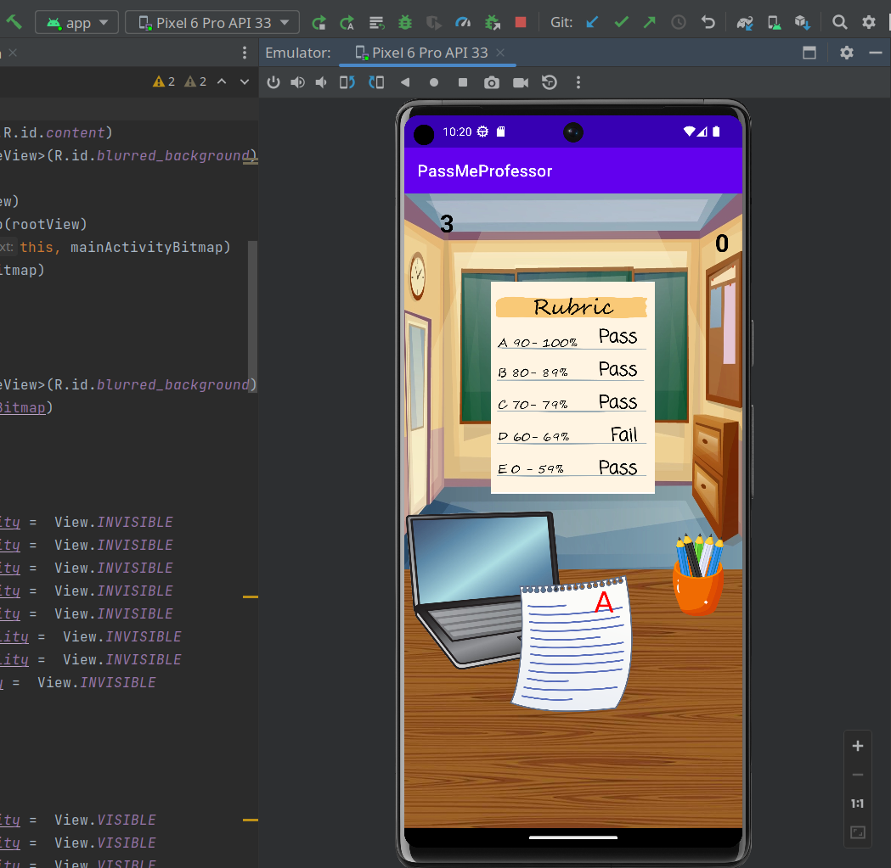

# PassMeProfessor

## Summary

## Deployment Instructions
- Install Android Studio using the install instructions [here](https://developer.android.com/studio/install)
- Download the git repo to your computer using either Github Desktop, or using the git command line.
- Open Android Studio and select the PassMeProfessor folder as the project to open
- Once the project opens, click on the drop down at the top of the window that says No Devices:

- Click on the Device Manager button to open the virtual device manager and click the Create Device button at the top of the window

- Now select the Pixel 6 Pro from the device selection window

- Next select system image Tiramisu and click Next

- Once the summary screen pops up click Finish and wait for the virtual device to be created, Now in the same drop down you should see Pixel 6 Pro API 33

- Use the green play button next to the device name to run the app on the device. The device should open and the game will automatically start

