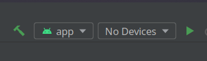

# PassMeProfessor

## Summary

## Deployment Instructions
- Install Android Studio using the install instructions [here](https://developer.android.com/studio/install)
- Download the git repo to your computer using either Github Desktop, or using the git command line.
- Open Android Studio and select the PassMeProfessor folder as the project to open
- Once the project opens, click on the drop down at the top of the window that says No Devices:

